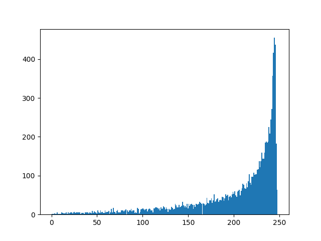

# References

> [Machine Unlearning](https://arxiv.org/abs/1912.03817)\
> Lucas Bourtoule, Varun Chandrasekaran, Christopher A. Choquette-Choo, Hengrui Jia, Adelin Travers, Baiwu Zhang, David Lie, Nicolas Papernot\
> _arXiv:1912.03817_

# Private Aggregation

To run: `python private_aggregation.py`

## Dataset

[MNIST](https://en.wikipedia.org/wiki/MNIST_database)


```
X: (60000, 28, 28, 1)
y: (60000, 10)
X_test: (10000, 28, 28, 1)
y_test: (10000, 10)
```

## Model

```
stax.serial(
  Conv(16, (8, 8), padding='SAME', strides=(2, 2)),
  Relu,
  MaxPool((2, 2), (1, 1)),
  Conv(32, (4, 4), padding='VALID', strides=(2, 2)),
  Relu,
  MaxPool((2, 2), (1, 1)),
  Flatten,
  Dense(32),
  Relu,
  Dense(10),
)
```

## Training parameters

```
num_shards = 250
num_slices = 1
```

## Results



The above is a histogram of the number of votes the correct label receives, i.e., a bar represents the number of times the correct label got X number of votes across the entire test set.

### Exponential Mechanism

```
Accuracy (eps=0.001): 0.1025
Accuracy (eps=0.01):  0.2355
Accuracy (eps=0.025): 0.5709
Accuracy (eps=0.05):  0.8701
Accuracy (eps=0.075): 0.9289
Accuracy (eps=0.1):   0.9410
Accuracy (eps=1.0):   0.9468
```

### LNMax

```
Accuracy (eps=0.001): 0.1082
Accuracy (eps=0.01): 0.2557
Accuracy (eps=0.025): 0.6062
Accuracy (eps=0.05): 0.8629
Accuracy (eps=0.075): 0.9235
Accuracy (eps=0.1): 0.9379
Accuracy (eps=1.0): 0.9465
```

# Private Ensemble

## Training parameters:

Model parameters:

```
num_shards: 20
num_slices: 1
```

```
sampling_method: uniform
l2_norm_clip: 1.5
noise_multiplier: 0.7
iterations:  500
batch_size: 64
step_size: 0.25
```

## Privacy guarantees:

```
ε = 7.0152
δ = 0.0001497
```

## Results

```
Accuracy: 0.9298
```
